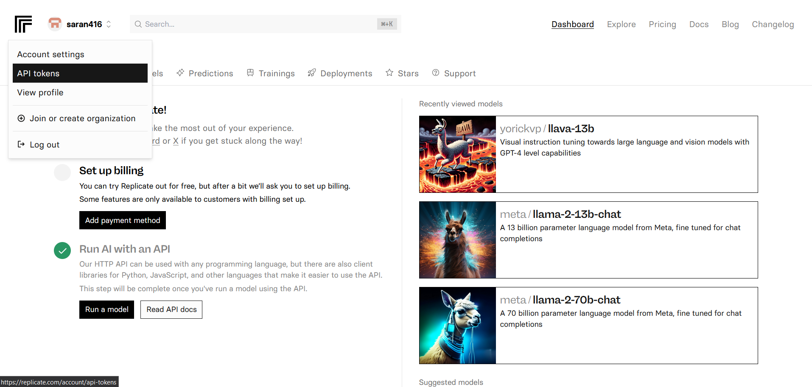
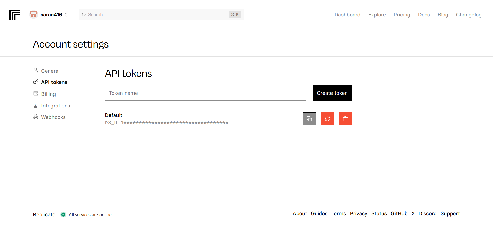
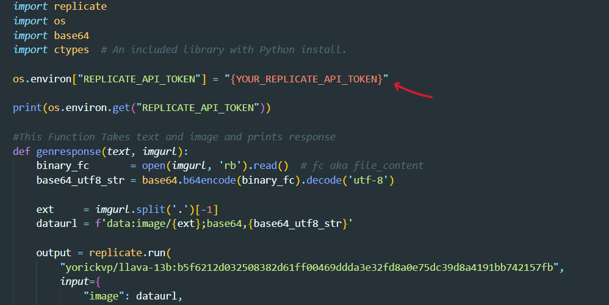
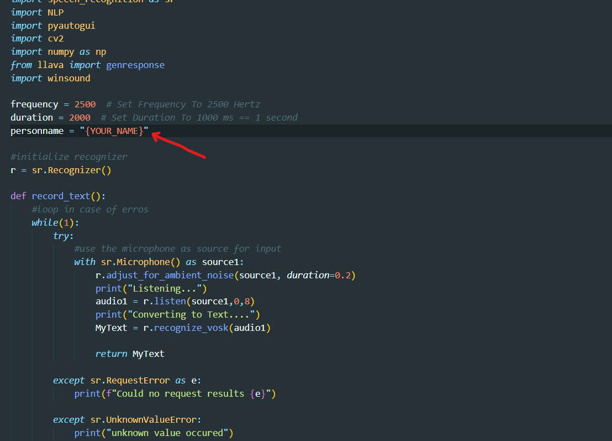
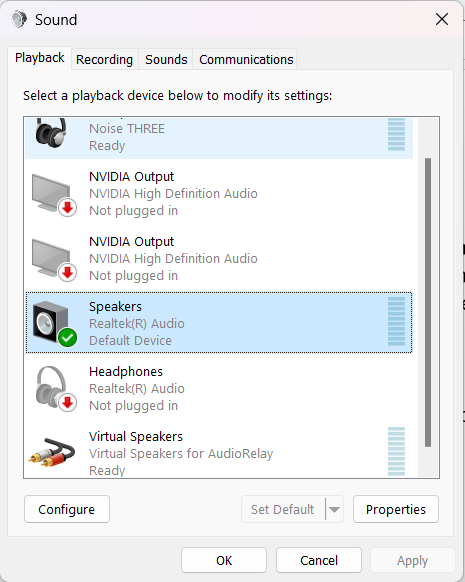
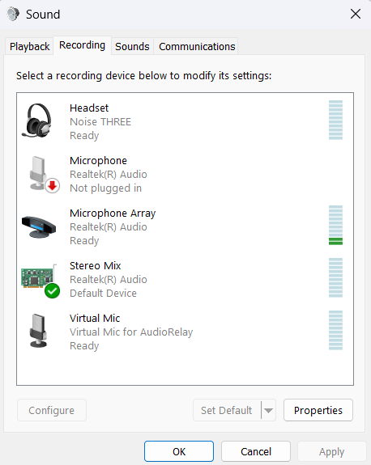

## About

**This project MeetingBuddy helps users to complete other tasks while they are in a video meeting. This code understands when a response is being expected from you and alerts you with a beep. It also prompts you with the response as well. We used an open-source LLM (LLaVA) to generate the response and we used Vosk to help us with speech to text transcription.**

Please look at the demo video below to see how it works

**Disclaimer:** Sometimes this doesn’t give accurate results since Vosk and LLaVA are both relatively light softwares and there might be small errors in transcription and generating responses.

## Prerequisites:

- Have Python installed on your computer.
- Have a GitHub account.

## Setup:

1. **Download the Git Repository:** [MeetingBuddy](https://github.com/AmoghBindal/MeetingBuddy)
2. **Download the following libraries of Python:**
   - replicate
   - sentence-transformers
   - opencv-python
   - pyautogui
   - pyaudio
   - nltk
   - SpeechRecognition
   - vosk
     In the command prompt, run the following command for each library:
     `pip install <LIBRARY_NAME>`
3. **Download the following transcription model:** [Vosk Models](https://alphacephei.com/vosk/models)

- Extract the zip file into the folder where you have cloned the repository and rename it as **“model”**.
- **Note:** The model can be replaced with another based on accent, language, and precision required.
  Model used in the demo: **vosk-model-en-in-0.5**.

4. **Using llava API from Replicate AI:** [llava-13b](https://replicate.com/yorickvp/llava-13b)

- Sign in with your GitHub profile.
- On the top-left, click on your profile name and then click on API tokens.
- Copy your Default API token.
- In the file ‘**llava.py**’, replace “{YOUR_REPLICATE_API_TOKEN}” with the copied text.

## Process:

5. **Change the name:**

- In the “**Main.py**” file, replace {YOUR_NAME} with your name.
  

6. **Changing default audio-input:**

- Open Windows run program `[⊞ Win + R]` and run `mmsys.cpl`.
- Go to the Playback section in the top left corner and ensure the default device is "Device Speakers" (while running the meeting, ensure audio is playing on the device speakers).
- Go to the Recordings section.
- Change Default device to "Stereo Mix".
- When joining the video meeting, ensure your Audio Input device is a Microphone and not Default settings since we changed the Default to Stereo Mix.
- When you are done using the application, make sure to change the sound settings to previously set Default Devices.
  
  

## Instructions:

- Run the “Main.py” file while the meeting is running on your screen.
- To stop the program, you can Keyboard Interrupt the code:
- Command Prompt (Windows): `Ctrl+C`

## Contributers

Saran Konala @Saran416
Amogh Bindal @AmoghBindal
